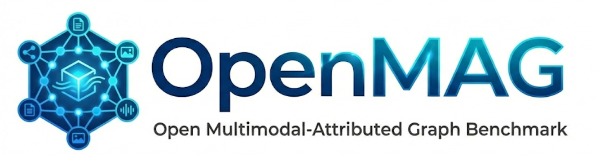
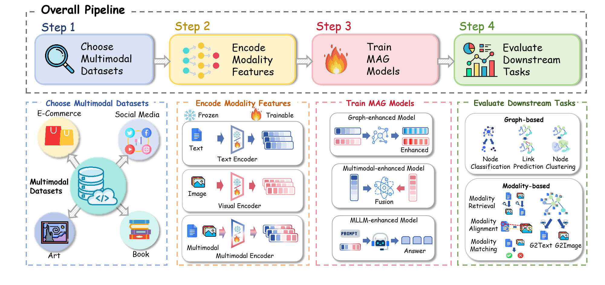

<div align="center">
  
</div>

<p align="center">
  <a href="#introduction">📚 Introduction</a> •
  <a href="#datasets">🗂️ Dataset Overview</a> •
  <a href="#encoders">🧩 Encoder Module</a> •
  <a href="#models">🧠 Model Library</a> •
  <a href="#tasks">🎯 Downstream Tasks</a> •
  <a href="#quick-start">🚀 Quick Start</a>
</p>

# OpenMAG: A Comprehensive Benchmark for Multimodal-Attributed Graph

## <span id="introduction">📚 Introduction</span>

**OpenMAG** is a unified and comprehensive benchmark platform designed for **Multimodal-Attributed Graph (MAG)** learning. It integrates **19 datasets** across **6 domains**, **16 modality encoders** ranging from frozen extractors to trainable backbones, and **24 graph learning models** to support **3 graph-centric** and **5 modality-centric** tasks.

### Key Contributions

1. **Comprehensive Benchmark**: OpenMAG integrates **19 datasets** in **6 different domains**. For multimodal encoding methods, we support **16 encoders** ranging from frozen extractors to trainable backbones. By standardizing **24 MAG learning models** and **8 downstream tasks**, OpenMAG serves as a comprehensive framework for the standardized evaluation of MAG learning methods.
2. **Valuable Insights**: We conduct systematic experiments from **5 valuable perspectives** and summarize **14 key conclusions**. We distill these findings into actionable insights that offer a clear roadmap for future research
3. **Open-sourced Benchmark Library**: We release OpenMAG as an open-source and user-friendly library, enabling researchers to easily evaluate custom methods or datasets. In addition, we provide comprehensive documentation and modular interfaces to foster collaborative innovation and facilitate the growth of the MAG community.

<div align="center">
  
  <p align="center"><em>Figure 1: The overall framework of OpenMAG.</em></p>
</div>
## <span id="datasets">🗂️ Dataset Overview</span>

OpenMAG collects **19 datasets** spanning **6 distinct domains**, ensuring diversity in evaluation to prevent overfitting to specific scenarios. You can download datasets from here. [🤗 Hugging Face](https://huggingface.co/datasets/Uniguri810/OpenMAG)


| Domain             | Datasets                                                                                       | Description                                                |
| :----------------- | :--------------------------------------------------------------------------------------------- | :--------------------------------------------------------- |
| **E-Commerce**     | `Grocery`, `Toys`,  `Cloth`, `Ele-fashion`, `Sports`, `Movies`                                 | Product co-purchasing networks with images/titles.         |
| **Social Media**   | `RedditS`                                                                                      | Post threading relationships with text/images.             |
| **Video Rec.**     | `Bili_series` (Cartoon, Dance, Food, Movie, Music), `DY` (TikTok), `KU` (Kuaishou), `TN`, `QB` | Video co-viewing networks with covers/descriptions.        |
| **Art Networks**   | `SemArt`                                                                                       | Fine-art paintings connected by shared attributes.         |
| **Image Networks** | `Flickr30k`                                                                                    | Image-caption semantic graphs for region-phrase alignment. |
| **Book Rec.**      | `Goodreads-nc`                                                                                 | Book co-shelving networks with summaries/covers.           |

## <span id="encoders">🧩 Encoder Module</span>

To process rich attributes from diverse modalities, OpenMAG integrates a wide range of **16 modality encoders**, supporting both frozen feature extraction and end-to-end fine-tuning. These encoders are categorized into **Text**, **Visual**, and **Multimodal** architectures, ensuring comprehensive coverage for various MAG scenarios.


| **Text Encoders**               | **Visual Encoders**                        | **Multimodal Encoders**            |
| ------------------------------- | ------------------------------------------ | ---------------------------------- |
| 🔹**Llama3.2-1B-Instruct**      | 🔸**ConvNeXtV2-Base-22k-224**              | 🔹**Clip-Vit-large-patch14**       |
| 🔹**XLM-RoBERTa-Base**          | 🔸**SwinV2-Large-Patch4-Window12-192-22k** | 🔹**Qwen2-7B-Instruct**            |
| 🔹**Facebook OPT-125M**         | 🔸**DINOv2-Large**                         | 🔹**Qwen2.5-3B-Instruct**          |
| 🔹**T5-Large**                  | 🔸**ViT-Base-Patch16-224**                 | 🔹**Llama3.2-11B-Vision-Instruct** |
| 🔹**bert-base-nli-mean-tokens** | 🔸**Vision GNN**                           | 🔹**ImageBind-Huge**               |
|                                 | 🔸**Pyramid TNT**                          |                                    |

## <span id="models">🧠 Model Library</span>

We integrate **24 representative models** categorized into three paradigms. In addition to foundational **GNN Backbones**, we incorporate specialized **MAG Models** tailored for complex multimodal graph learning tasks.

### 1. GNN Backbones

*Foundational graph neural networks used as structural encoders.*


| Model         | Paper                                                                                                                                                                                  |
| :------------ | :------------------------------------------------------------------------------------------------------------------------------------------------------------------------------------- |
| **GCN**       | Semi-Supervised Classification with Graph Convolutional Networks.[[ICLR 2017]](https://arxiv.org/abs/1609.02907)                                                                       |
| **GAT**       | Graph Attention Networks.[[ICLR 2018]](https://arxiv.org/abs/1710.10903)                                                                                                               |
| **GraphSAGE** | Inductive Representation Learning on Large Graphs.[[NeurIPS 2017]](https://arxiv.org/abs/1706.02216)                                                                                   |
| **GIN**       | How Powerful are Graph Neural Networks?[[ICLR 2019]](https://arxiv.org/abs/1810.00826)                                                                                                 |
| **ChebNet**   | ChebNet: Efficient and Stable Constructions of Deep Neural Networks with Rectified Power Units via Chebyshev Approximations.[[Springer Nature 2021]](https://arxiv.org/abs/1911.05467) |
| **RevGAT**    | Training Graph Neural Networks with 1000 Layers.[[ICML 2021]](https://arxiv.org/abs/2106.07476)                                                                                        |
| **GCNII**     | Simple and Deep Graph Convolutional Networks.[[ICML 2020]](https://arxiv.org/abs/2007.02133)                                                                                           |
| **GATv2**     | How Attentive are Graph Attention Networks?[[ICLR 2022]](https://arxiv.org/abs/2105.14491)                                                                                             |

### 2. MAG Models

*Specialized models designed for Multimodal-Attributed Graphs, categorized by their enhancement focus.*


| Category                | Model           | Paper                                                                                                                                              |
| :---------------------- | :-------------- | :------------------------------------------------------------------------------------------------------------------------------------------------- |
| **Graph-enhanced**      | **GraphMAE2**   | GraphMAE2: A Decoding-Enhanced Masked Graph Autoencoder.[[WWW 2023]](https://arxiv.org/abs/2304.04779)                                             |
|                         | **DMGC**        | Disentangling Homophily and Heterophily in Multimodal Graph Clustering.[[arxiv 2025]](https://arxiv.org/abs/2507.15253)                            |
|                         | **DGF**         | Cross-Contrastive Clustering for Multimodal Attributed Graphs with Dual Graph Filtering.[[arXiv 2025]](https://arxiv.org/abs/2511.20030)           |
|                         | **MIG-GT**      | MIG-GT: Multiplex Information Graph with Graph Transformer.[[arXiv 2025]](https://arxiv.org)                                                       |
| **Multimodal-enhanced** | **MMGCN**       | MMGCN: Multi-modal Graph Convolution Network for Personalized Recommendation of Micro-video.[[ACM MM 2019]](https://arxiv.org/abs/1908.10193)      |
|                         | **MGAT**        | MGAT: Multimodal Graph Attention Network for Recommendation.[[IPM 2020]](https://doi.org/10.1016/j.ipm.2020.102277)                                |
|                         | **LGMRec**      | LGMRec: Local and Global Graph Learning for Multimodal Recommendation.[[AAAI 2024]](https://arxiv.org/abs/2312.16912)                              |
|                         | **MGNet**       | Multiplex Graph Networks for Multimodal Brain Network Analysis.[[ACM BCB 2021]](https://dl.acm.org/doi/10.1145/3459930.3469509)                    |
|                         | **GSMN**        | Graph Structured Network for Image-Text Matching.[[CVPR 2020]](https://arxiv.org/abs/2004.00277)                                                   |
|                         | **MHGAT**       | Multimodal heterogeneous graph attention network.[[IJCAI 2022]](https://www.ijcai.org/proceedings/2022/0458.pdf)                                   |
| **MLLM-enhanced**       | **UniGraph2**   | UniGraph2: Learning a Unified Embedding Space to Bind Multimodal Graphs.[[arXiv 2025]](https://arxiv.org/abs/2502.00806)                           |
|                         | **GraphGPT-O**  | GRAPHGPT-O: Synergistic Multimodal Comprehension and Generation on Graphs.[[CVPR 2025]](https://cvpr.thecvf.com/virtual/2025/poster/32574)         |
|                         | **MLaGA**       | MLaGA: Multimodal Large Language and Graph Assistant.[[arXiv 2025]](https://arxiv.org/abs/2506.02568)                                              |
|                         | **InstructG2I** | INSTRUCTG2I: Synthesizing Images from Multimodal Attributed Graphs[[NeurIPS2024]](https://arxiv.org/abs/2410.07157)                                |
|                         | **NTSFormer**   | NTSFormer: A Self-Teaching Graph Transformer for Multimodal Isolated Cold-Start Node Classification[[AAAI 2026]](https://arxiv.org/abs/2507.04870) |
|                         | **Graph4MM**    | Graph4MM: Weaving Multimodal Learning with Structural Information.[[ICML 2025]](https://arxiv.org/abs/2510.16990)                                  |

## <span id="tasks">🎯 Downstream Tasks</span>

OpenMAG supports a diverse spectrum of downstream tasks:

### Graph-Centric Tasks

* **Node Classification**: Learning discriminative node representations.
* **Link Prediction**: Inferring missing edges based on topology and semantics.
* **Node Clustering**: Partitioning nodes into semantic groups without supervision.

### Modality-Centric Tasks

* **Modality Matching**: Verifying instance-level cross-modal correspondence.
* **Modality Retrieval**: Image-to-Text and Text-to-Image retrieval.
* **Modality Alignment**: Fine-grained geometric consistency between features.
* **Graph-to-Text Generation (G2Text)**: Generating natural language descriptions conditioned on graph context.
* **Graph-to-Image Generation (G2Image)**: Synthesizing images from Multimodal Attributed Graphs.

## <span id="quick-start">🚀 Quick Start</span>

### Step 1: Clone Repository

```bash
git clone <REPO-URL>
cd OpenMAG
```

### Step 2: Install Dependencies

#### General Dependencies

```bash
# Create virtual environment
conda env create -f openmag.yml
conda activate openmag

# Install PyTorch
pip install torch==2.8.0 torchvision==0.23.0 torchaudio==2.8.0 --index-url https://download.pytorch.org/whl/cu128
```

#### Additional Dependencies

Libraries such as `torch_scatter`, `torch_sparse`, and `torch_cluster` heavily depend on the specific PyTorch and CUDA versions. To avoid complex compilation errors, **we strongly recommend installing them from pre-built wheels** rather than using `pip install` directly.

Example installation for **CUDA 12.8**:

```
pip install torch_geometric
pip install pyg_lib torch_scatter torch_sparse torch_cluster torch_spline_conv -f https://data.pyg.org/whl/torch-2.8.0+cu128.html
```

### Step 3: **Run the Main Script**

After installing the dependencies, you can run the main script using the following command:

```bash
python src/main.py dataset=<dataset_name> model=<model_name> task=<task_name> text_encoder=<text_encoder> visual_encoder=<visual_encoder> device=<device_name>
```

#### Optional arguments:

- `dataset=<dataset_name>`: The name of the multimodal dataset.

  - **Options**: `Toys`, `Grocery`, `RedditS`, `Flickr30k`, `Bili_cartoon`, etc.
- `model=<model_name>`: The architecture of the MAG learning model.

  - **Options**: `LGMRec`, `GraphGPT-O`, `GraphMAE2`, `MMGCN`, `UniGraph2`, `GAT`, `MLP`, etc.
- `task=<task_name>`: The downstream task to evaluate.

  - **Options**: `node_classification`, `link_prediction`, `node_clustering`, `g2text`, `g2image`, `modality_retrieval`, etc.
- `text_encoder=<text_encoder>`: The backbone used for encoding textual attributes.

  - **Options**: `bert`, `opt`, `llama3.2`, `t5`, etc.
- `visual_encoder=<visual_encoder>`: The backbone used for encoding visual attributes.

  - **Options**: `vit`, `clip`, `dino`, `swin`, etc.
- `device=<device_name>`: The computing device to use.

  - **Options**: `cpu`, `cuda:0`, `cuda:1`, etc.

### Examples

**Node Classification task with LGMRec on Toys Dataset**

```bash
python main.py \
  dataset=toys \
  model=dmgc \
  task=nc \
  text_encoder=clip \
  visual_encoder=clip \
  task.batch_size=1024 \
  task.n_epochs=100 \
  task.n_run=3
```

This command will:

- Use the **DMGC** model
- Use the **Toys** dataset
- Use the **CLIP** as text/visual encoders
- Run the **Node Classification** Task
- Train for **100 epochs** with a **batch size of 1024** for **3 runs**
